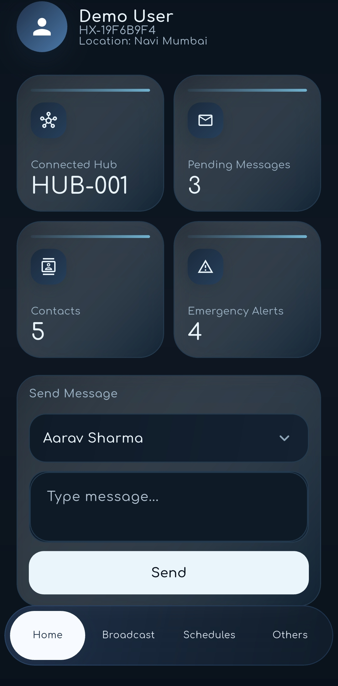

# XenComm

XenComm is the mobile client for the XENECOSYS ecosystem. It is built as an offline-first Flutter app for local communication, emergency alerts, hub discovery, message sync, and DTN-style interaction when normal infrastructure is unavailable.

[](https://youtu.be/j_z4tbJNfmw)

## What It Does

- Supports offline and low-connectivity messaging
- Handles emergency, medical, government, and normal message flows
- Connects to nearby XenHub nodes for sync and relay
- Includes DTN simulation and data-mule related views
- Keeps the app organized around services, repositories, UI, and routing layers

## File Structure

```text
XenComm/
|-- README.md
|-- LICENSE
|-- app.ui/
|   |-- home.jpg
|   |-- Broadcast.jpg.jpg
|   |-- Contact.jpg.jpg
|   |-- Others.jpg.jpg
|   `-- Schedule.jpg.jpg
`-- Xencomm/
    |-- README.md
    |-- ARCHITECTURE.md
    |-- CHANGELOG.md
    |-- pubspec.yaml
    |-- analysis_options.yaml
    |-- assets/
    |-- lib/
    |   |-- core/
    |   |-- dtn/
    |   |-- models/
    |   |-- providers/
    |   |-- repositories/
    |   |-- routing/
    |   |-- services/
    |   |-- simulation/
    |   `-- ui/
    |-- android/
    |-- ios/
    |-- linux/
    |-- macos/
    |-- web/
    |-- windows/
    `-- test/
```

## Notes

- `app.ui/` contains UI screenshots for the mobile app.
- `Xencomm/` is the actual Flutter project source.
- Generated folders such as `build/` and `.dart_tool/` should not be committed.
