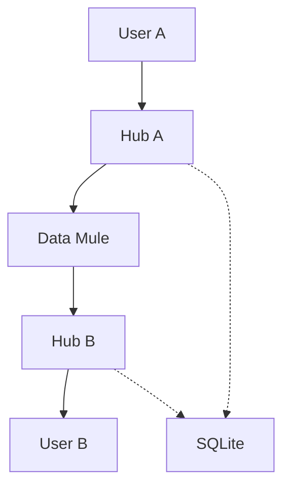
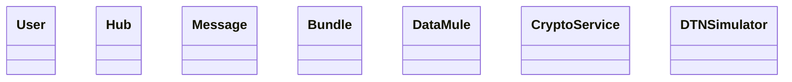
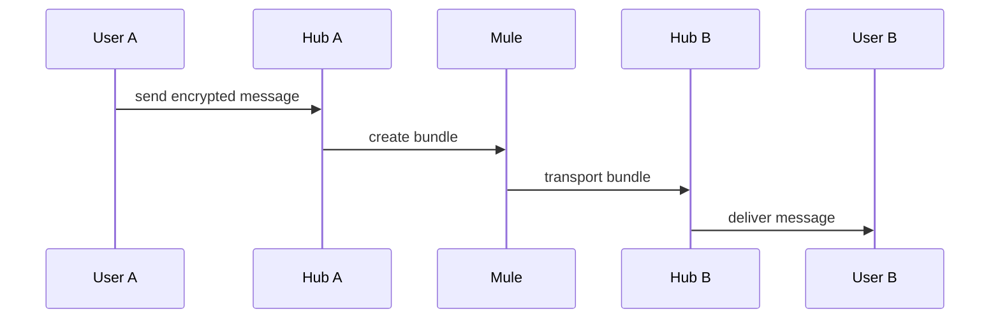
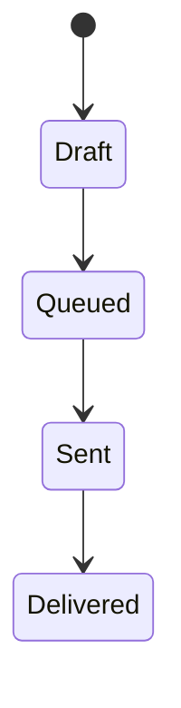

# NexusLink Architecture

## System Diagram

```mermaid
graph TB
  UA["User A"]
  UB["User B"]
  HA["Hub A"]
  HB["Hub B"]
  M1["Data Mule"]
  DB["SQLite"]

  UA --> HA
  HA --> M1
  M1 --> HB
  HB --> UB
  HA -.-> DB
  HB -.-> DB
```

## Class Diagram

```mermaid
classDiagram
  class User
  class Hub
  class Message
  class Bundle
  class DataMule
  class CryptoService
  class DTNSimulator
```

## Sequence Diagram

```mermaid
sequenceDiagram
  participant U as User A
  participant H as Hub A
  participant M as Mule
  participant B as Hub B
  participant R as User B

  U->>H: send encrypted message
  H->>M: create bundle
  M->>B: transport bundle
  B->>R: deliver message
```

## State Diagram

```mermaid
stateDiagram-v2
  [*] --> Draft
  Draft --> Queued
  Queued --> Sent
  Sent --> Delivered
```
